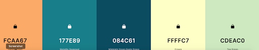
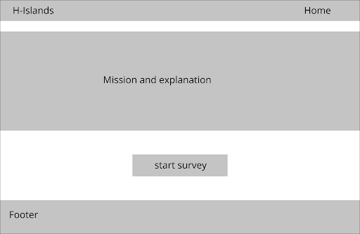
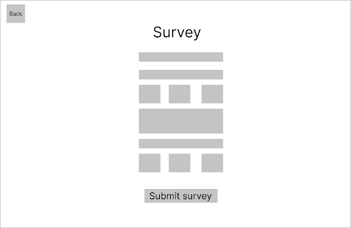
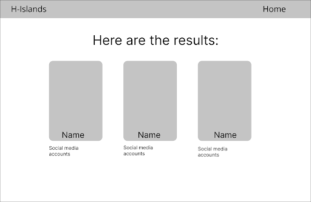
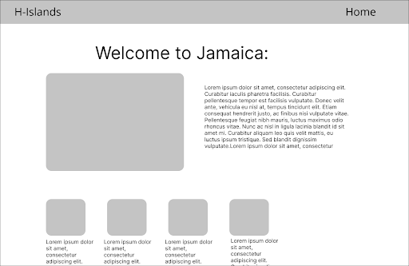

<h1>H-Islands Specifications</h1>

<h3>Problem Statement</h3>

The global pandemic has drastically decreased tourist arrivals around the world, disproportionately affecting the tourism industry in small island developing states (SIDS). How may we promote travel to SIDS to young adults to support their economic recovery?

<h3>Problem Description</h3>

The global Covid-19 pandemic caused fear around the world. As countries and people were trying to get control over case numbers, restrictions and protocols were put in place. As quarantine and social distancing became a new norm, traveling became a risk. Due to the new reality, the world was facing international tourism paused completely.

During the pandemic, many SIDS states developed programs that would allow tourists who come from “low-risk” countries to visit. For example, Australia began the “Travel bubble” program to allow visitors from New Zealand to come into Australia without the required testing and quarantine time. Others came out with remote working programs where tourists were incentivized to come live on the island while they continue to work remotely. While these programs did help tourists travel in the safest form, it was not enough to bridge the gap of the lost revenue (Nadeem). Today the pandemic is in a state where people are feeling a bit more comfortable traveling. SIDS countries need to adapt to the new and rapid world where tourists are eager to travel once again.

This problem affects small island developing states(SIDS) and their citizens. SIDS are states who face social, economic, and environmental vulnerabilities that are unique to their circumstances (un.org). The Economics of SIDS is highly integrated and dependent on the tourism industry, involving countless jobs and businesses. When the pandemic hit in the year 2020, tourism all over the world dramatically paused. This pause lasted for almost a year causing the loss of jobs in the tourism industry, disproportionately impacting women and youth. Numerous planned business expansions fell through taking away thousands of possible new jobs, significantly affecting economies all over the world. As stated in the article Wish you Were Here by Adam Behsudi “The Caribbean Hotel and Tourism Association has projected that as many as 60 percent of the 30,000 new hotel rooms that were in the planning or construction phase throughout the Caribbean region will not be completed as a result of the crisis.”(Behsudi)

<h4>Solution Summary <h5>Briefly, summarize how the product described below will help solve the state problem. </h5></h4>

Our solution is a website that recommends users to go to SIDS based on their trip preferences. At first, the website will explain the issue at hand and then will prompt the user to take the SIDS matching survey. The survey will be based on trip preferences questions such as time of travel, activities, access to wifi, etc. Once the user fills out the survey and submits it, our website will then recommend 3 destinations that best fit their answers. Our reach goal is to allow the user to click on the recommended destination, and get a summary of it with a bunch of recommendations. We hope that our website will encourage users to visit the SIDS that best fits them.

<h5>The software we are going to use: </h5>
We are going to develop a website using HTML, CSS, Javascript, and REACT. 
For our data set, we will build it ourselves using a .json file.

<h5>Details about the textual and visual content of the design: </h5>
Font family:
Open Sans, Montserrat, Inter

<h5>Color scheme: </h5>
We want to make our website with a tropical aesthetic. Here is our perspective color palette.

<h5>Rough Overview of User Story</h5>

<h5>Figma page</h5>
https://www.figma.com/file/fHfdk1cw1CMnXPek32bKH8/Untitled?node-id=0%3A1

Enters site -> Reads summary of survey experience -> Starts survey -> Answers survey questions -> Completes survey -> Views results as three options for a destination -> (stretch goal) clicks on one of three options to see more information

<h5>Home page: </h5>
<li>A mission statement explaining the significance and the impact of our solution.
<li>Prompts users to fill out the survey.
<li>Simple design

<h5>Survey page: </h5>
<ul>A survey with a bunch of questions such as
<li>What time of year would you want to travel?
<li>What weather were you hoping to be experiencing?
<li>What facilities would you like to have?
<li>What area would you rather travel to?
  <ul>
    <li>Africa, Indian Ocean, Mediterranean and South China Sea (AIMS)
    <li>Pacific
    <li>Caribbean
    <li>No preference
  </ul>

<li>Preferred spoken language?
    <ul>
      <li>English
      <li>Spanish
      <li>French
      <li>Portuguese
    </ul>
<li>What climate classification do you prefer?
  <ul>
    <li>tropical savanna climate
    <li>tropical rainforest climate
  </ul>
<li>Overnight stay:
  <ul>
    <li>Hostels
    <li>Luxury hotels
    <li>Dorms
    <li>Tents
  </ul>
<li>Are you vaccinated?
  <ul>
    <li>Yes
    <li>No
  </ul>
<li>What attractions do you want to experience more:
  <ul>
    <li>Bungee jumping
    <li>Sky Diving
    <li>Exotic animals
    <li>Swimming with dolphins
  </ul>

<h5>Results page:</h5>
<li>It will have the top three SIDS states that align with the survey answers.
  <ul>
    <li>Social media accounts
  </ul>

<h5>Description page:  (Stretch Goal):</h5>
<li>Users will be able to click on the state and get a detailed explanation of the state and what they can do there.
  <ul>
    <li>Recommendations for local businesses, unique activities, must-see places…
  </ul>

Potential Errors:

 | Potential Error  | How will we tackle this error |
| --- | ----------- |
| Users answering all “no preference” | We will give an error message that says “We didn't get enough information to provide you with a location that matches your preferences, but here are cool places you should check out!” |
| Less than three results based on the preferences selected by the user |  We can have a filler location to suggest with a disclaimer that it doesn’t fit their survey results but could be something to explore |
